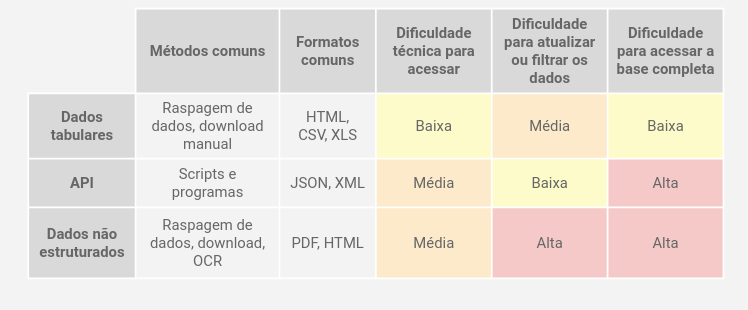

# Metodos de obtenção de dados  

Formas de obtenção  

  

--- 

|;-----| Métodos comuns | Formatos comuns | Dificuldade técnica para acessar | Dificuldade para atualizar ou filtrar os dados | Dificuldade para acessar a base completa| 
|Dados tabulares| download manual de bases de dados, raspagens de dados | HTML, XLS, CSV | Baixa | Média | Baixa |
| API | Scripts e programas | XML, JSON | Média | Média | Alta |
| Dados não estruturados| Raspagem de dados, download, OCR | PDF, HTML | Média | Alta | Alta |  

---

* Raspagem de dados: é a coleta de conteúdos de um site por meio de ferramentas de interface gráfica ou por meio de códigos;  

Conhecimentos necessários: HTML, CSS, JavaScript, XPath.  

Dicas de ferramentas para ajudar na raspagem de dados:  

[WebScraper](https://webscraper.io/);  
[Google Sheets](https://docs.google.com/spreadsheets/u/0/);  
[BeautifulSoup](https://www.crummy.com/software/BeautifulSoup/bs4/doc/) (Python);  
[rvest](https://github.com/tidyverse/rvest) (R);  

