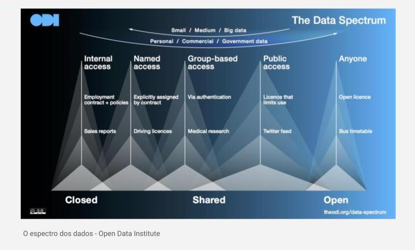
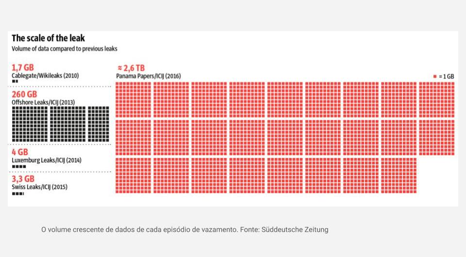

# 1.4 - Descubra novas fontes de dados  

| Acesso interno | Acesso nomeado | Acesso baseado em grupo | Dados públicos | Dados governamentais |
| :--------------: | :----------------: | :--------------: | :-------------: | :---------------: |
| Contrato de trabalho + políticas | Atribuído explicitamente por contrato | Via autenticação | Licença com uso limitado | Licença aberta |
| Relatórios de vendas | Carteira de habilitação | Pesquisa médica | Feed do Twitter | Grade horária do Transporte público |
| Fechado |Fechado| Compartilhado | Compartilhado | Aberto |  

## Volume crescente de dados nos episódios de vazamento

## Portais de dados abertos

* O que são dados abertos?  

São dados que podem ser livremente utilizados, reutilizados e redistribuídos por qualquer pessoa. Eles podem exigir atribuição de fonte e compartilhamento de fonte pelas mesmas regras.  
São legíveis por máquina.  

### Referências

- [O espectro dos dados]() (Open Data Institute);  

- [O volume crescente de dados de cada episódio de vazamento](https://panamapapers.sueddeutsche.de/articles/56febff0a1bb8d3c3495adf4/) (Süddeutsche Zeitung);  

- [Portal Brasileiro de Dados Abertos](http://www.dados.gov.br/);  

- [Índice de Qualidade de Água – Média da Série Disponível](http://www.dados.gov.br/dataset/indice-de-qualidade-de-agua-media-da-serie-disponivel) (Portal Brasileiro de Dados Abertos);  

- [Dados Abertos](http://dados.prefeitura.sp.gov.br/pt_PT/) (Prefeitura de São Paulo);

- [DATA.GOV](https://www.data.gov/) (Governo dos EUA);  

- [data.gov.au](https://data.gov.au/) (Governo da Austrália);  

- [Dados Recife](http://dados.recife.pe.gov.br/) (Prefeitura do Recife);  

- [Portal de Dados Abertos do Estado de Santa Catarina](http://dados.sc.gov.br/) (Controladoria-Geral do Estado);  

- [datos.gob.es](https://datos.gob.es/) (Governo da Espanha);  

- [data.world](https://data.world/) (data.world Inc.);  

- [Google DataSet Search](https://datasetsearch.research.google.com/) (Google);  

- [Lei de Acesso à Informação](http://www.planalto.gov.br/ccivil_03/_ato2011-2014/2011/lei/l12527.htm) (Planalto);  

- [Fiquem Sabendo](https://fiquemsabendo.com.br/);  

- [Achados e Pedidos](http://www.achadosepedidos.org.br/) (ABRAJI);  

- [TransparênciaBrasil](https://www.transparencia.org.br/) (ABRAJI);  

